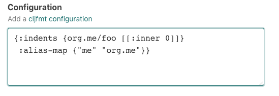

# What it's useful for

cljmft makes sure everyone on your team is using the same consistent formatting
for all Clojure and ClojureScript files.  
This skill watches all your team' commits to GitHub, and uses cljfmt to ensure
that the code follows consistent formatting guidelines. If possibles fixes are
detected, the skill will send you those fixes in a pull request, or by commiting
directly to a branch.

There are already great ways to integrate [cljfmt][cljfmt] into your local
development flow.  
However, this skill validates and fixes unformatted commits that still manage to
slip through cracks. If you never push unformatted commits, then you won't
notice this skill is even running.

It does not rely on any project configuration (e.g deps.edn or leiningen
project.clj). Instead, it runs `cljfmt fix` whenever the a repository is
updated.

Code reviews are so much better when your team is using the same formatting.

# Before you get started

1.  **GitHub**

The **GitHub** integration must be configured in order to use this skill. At
least one repository must be selected.

# How to configure

1.  **Choose how to apply formatting changes**

    Choose one of these options:

    1. `Commit to default branch only` - only format the default branch, and
       push fixes directly to the default branch
    2. `Commit to any branch` - push formatting fixes to all branches
    3. `Raise pull request for default branch only; commit to other branches` -
       formatting fixes for the default branch should raise PRs. Fixes to other
       branches should commit directly to the branch.
    4. `Raise pull request for any branch` - always use Pull Requests.

    

2.  **Specify formatting rules configuration**

    Optionally, customize the configuration that `cljfmt` will use by adding
    your custom rules here. In practice, the "do nothing" approach works quite
    well. The
    [defaults from `cljfmt`](https://github.com/weavejester/cljfmt/blob/master/cljfmt/resources/cljfmt/indents/clojure.clj)
    are a great start.

    The [cljfmt configuration documentation][configuration] outlines different
    ways to control how the code is formatted.

    

3.  **Select repositories**

    By default, this skill will be enabled for all repositories in all
    organizations you have connected. To restrict the organizations or specific
    repositories on which the skill will run, you can explicitly choose
    organization(s) and repositories.

    Either select all, if all your repositories should participate, or choose a
    subset of repositories that should stay formatted. This skill will take no
    action on repositories that do not contain `.clj`, `.cljs`, or `cljc` files.

    

# How to Use

1. **Configure the skill as described above**

1. **Commit and push your code changes**

1. **Enjoy automatic formatting!**

And a huge thanks to [cljfmt][cljfmt]!

To create feature requests or bug reports, create an
[issue in the repository for this skill](https://github.com/atomist-skills/cljfmt-skill/issues).
See the [code](https://github.com/atomist-skills/cljfmt-skill) for the skill.

[cljfmt]: https://github.com/weavejester/cljfmt
[editor-support]: https://github.com/weavejester/cljfmt#editor-support
[configuration]: https://github.com/weavejester/cljfmt#configuration
