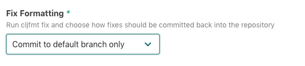
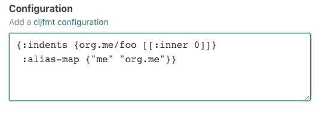

# `@atomist/cljformat-skill`

<!---atomist-skill-readme:start--->

Activate the Clojure/ClojureScript formatting tool [cljfmt][cljfmt] on any Push event to a repository containing
clojure files.
  
# What it's useful for

Check the formatting of your Clojure code whenever a repository is updated.  If there are any formatting fixes required,
raise a PR, or send a Commit back to the Repository.

# Before you get started

The **GitHub** integration must be configured in order to use this skill. 
At least one repository must be selected. 

# How to configure

1.  **Choose which branches should be automatically formatted, and how fixes should be submitted**

    Users can choose between 4 options:
    1. `Commit to default branch only` - only format the default branch, and push fixes directly to the default branch
    2. `Commit to any branch` - push formatting fixes to all branches
    3. `Raise pull request for default branch only; commit to other branches` - formatting fixes for the default branch
        should raise PRs.  Fixes to other branches should commit directly to the branch.
    4. `Raise pull request for any branch` - always use Pull Requests.
    
    
    
2.  **Default Formatting rules**

    [cljfmt configuration documentation][configuration] outlines different ways that users can control how the code
    is formatted.  
    
    In practice, the "do nothing" approach works quite well here.  The 
    [defaults from `cljfmt`](https://github.com/weavejester/cljfmt/blob/master/cljfmt/resources/cljfmt/indents/clojure.clj) 
    are a great start.
    
    If you would like to customize the configuration of `cljfmt`, you can add your custom rules here
    
    
                    
    A `cljfmt.edn` in the root of any Repo being formatted, will over ride any defaults.
    
3.  **Select some Repos**

    Either select all, if all your Repositories should participate, or choose a subset of Repositories that should 
    stay formatted.  This skill will take no action on repositories that do not contain `.clj`, `.cljs`, or `cljc` files.
    
        

# How to Use

There are already great ways to integrate [cljfmt][cljfmt] into your local development flow.  See the docs on
[editor support here][editor-support].  However, this skill validates and fixes unformatted Commits that still manage
to be pushed.  If you never push unformatted Commits, you won't notice this skill is even running.

It does not rely on any project configuration (e.g deps.edn or leiningen project.clj).  Instead,
it uses the Atomist GitHub application to run `cljfmt fix` whenever the a Repo is updated.  

Code reviews are so much better when your team is using the same formatting.  And a huge thanks to [cljfmt](cljfmt)!!!

[cljfmt]: https://github.com/weavejester/cljfmt
[editor-support]: https://github.com/weavejester/cljfmt#editor-support
[configuration]: https://github.com/weavejester/cljfmt#configuration

<!---atomist-skill-readme:end--->

---

Created by [Atomist][atomist].
Need Help?  [Join our Slack workspace][slack].

[atomist]: https://atomist.com/ (Atomist - How Teams Deliver Software)
[slack]: https://join.atomist.com/ (Atomist Community Slack)